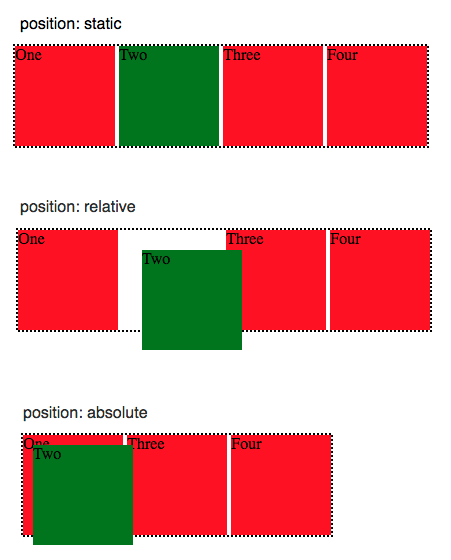
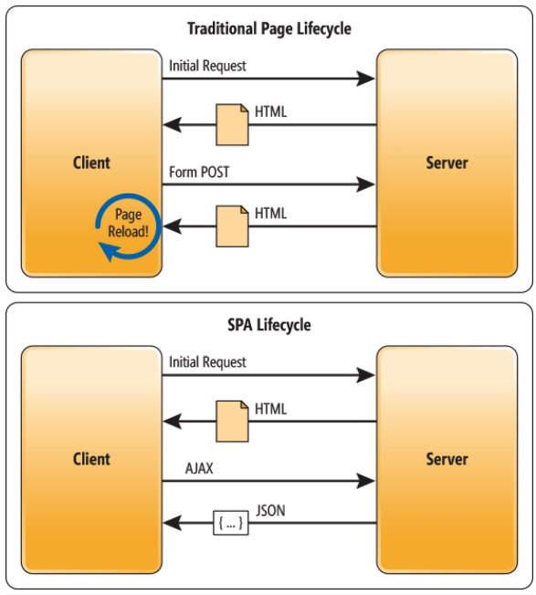

# Interview Prep Notes from 2022

**Note:** On VSCode, install the extension "Markdown Preview Enhanced" to see a preview of the changes to this markdown file

# LEETCODE

* Array
  * Two Pointer
  * Sliding Window
  * Cyclic Sort
  * Backtracking/Subsets
  * Binary Search
* Matrix
  * Merge Intervals
  * BFS
  * DFS
  * Backtracking/Subsets
* String
  * Two pointer
  * Sliding window
* Linked List
  * In-place reversal
* Trees
  * BFS
  * DFS

# DEFINITIONS AND TOPICS

* ## Rest vs GraphQL
  * GraphQL
    * Single request across multiple endpoints (ex. getPrefilledData covering identities, planningProfile, retirementProfile, incomes)
    * Server declares what resources are available, and the client asks for what it needs at the time
  * REST
    * “Representational state transfer”
    * Resources are determined by the server (ex.Cocoon follows RESTful architecture)
    * The server handles the transformation of the data received from the DB to be sent to the client
    * https://www.freecodecamp.org/news/benefits-of-rest/
* ## What is Node.js? Pros/Cons of Node.js?
  * https://youtu.be/gnJWDW4jae0?t=189 (by Jason btw)
* ## Fixed/Static, Fluid, Adaptive, and Responsive layouts
  * Fixed/Static - not used by many websites anymore.
    * Layout has a fixed width in pixels. The ‘container’ of the website is programmed to not move. Width stays the same independent of screen size
  * Fluid
    * Specify sizes in percentages, not pixels. If the screen size changes, the proportion of elements will stay the same
    * Cons - on smaller screens, things like columns can get very very narrow/tall
  * Adaptive
    * Several versions of the layout which are displayed based on screen size of the viewer. Think of it as several fixed layout designs. Layout A is displayed b/w sized X-XX, etc.
    * Pros - designer has more certainty. Cons - time and effort
  * Responsive
    * This is the expectation these days
    * Best of fluid and adaptive
    * There are several breakpoints, which divide all possible screen sizes in ranges. The interface has diff layout depending on screen size it’s viewed on. And depending on screensize, elements will stretch/shrink. Provides custom experience for whichever size it’s viewed on.
    * https://ux-alpaca.medium.com/so-what-exactly-is-the-difference-between-fixed-fluid-adaptive-and-responsive-layouts-and-why-3773272d8481
      * Above link as good visuals
* ## Absolute vs Relative positioning CSS
  * Position: absolute - position element based on its closes positioned ancestor position - relative to its parent’s pos and changing the layout around it
  * Position: relative - position element based on its current pos w/o changing layout
  * https://leannezhang.medium.com/difference-between-css-position-absolute-versus-relative-35f064384c6
  * 
* Object Oriented Programming vs Functional Programming vs Reactive Programming (RxJS is reactive programming)
* Public, Private, Protected
  * Public - can be accessed everywhere
  * Protected - can be accessed only within the class itself and by inheriting child classes
    * Ex. a method declared “protected” in the SS base container, would be accessible by SS base container and all inheriting children
  * Private - can only be accessed by the class that defines the member
* Async and Promises
  * Async and Promises 
  * https://github.com/jumaschion/You-Dont-Know-JS-1/tree/master/async%20%26%20performance
* DOM
  * Document Object Model
  * Representing the HTML document as a tree structure
  * Difference between virtual DOM, shadow DOM, and real (normal) DOM
    * Virtual DOM - A virtual copy of the real DOM. In React, whenever state changes in an element, the updated virtual DOM is compared to the previous version. If there’s a change, React will update that element only in the real DOM. This concept is used in React.
      * (Angular does not use virtual DOM, it has its own change detection strategy)
    * The use of Virtual DOM is faster than DOM manipulation
    * https://adhithiravi.medium.com/react-virtual-dom-explained-in-simple-english-fc2d0b277bc5 
* SPA - Single Page Application
  * Web app implementation that loads only a single web document, then updates the body content of that single document via JS APIs like XMLHttpRequest and Fetch when diff content is being shown. This allows user to use websites without loading whole new pages from the server
  * A web app that interacts w/ the web browser by dynamically rewriting the current web pg w/ new data from the web server, instead of the default method of the browser loading entire new pgs.
  * A SPA reloads only the data necessary for the user. A multiple-page-app, the entire web page content is refreshed, which is true about all pgs requested by the user
  * SPAs give you the impression that a page is changing to a new page, but it’s not.
  * SPA frameworks include React, Angular, Vue.js
  * Examples: Gmail, Facebook, Twitter, Airbnb, Netflix, Pinterest
  * Pros
    * Performance gains - things happen in an instant - don’t see the reload
    * Dynamic experience
  * Cons
    * SEO
    * More effort required to maintain state, implement navigation, and do meaningful performance monitoring
  * https://developer.mozilla.org/en-US/docs/Glossary/SPA
  * https://w3-lab.com/single-page-applications-2021/ 
    * 
* Databases
  * Relational vs non-relational databases and pros/cons, schema vs schema-less
    * Relational Databases are structured, they store data in tables and rows (records)
  * 1:1
  * 1:M
  * M:M
* SQL vs NoSQL
* MVC - model, view, controller framework and pros/cons
* How to fetch data
  * Be able to give a succint overview of what happens starting from “when user clicks a button”
* Client / Server
  * Definitions
  * Client side JS frameworks
    * https://developer.mozilla.org/en-US/docs/Learn/Tools_and_testing/Client-side_JavaScript_frameworks
  * Client side vs server side
  * What happens when a user makes a request?
* Back End vs Front End
* Definition of a class
  * In JS, it is a blueprint for creating objects. Class encapsulates data and functions and manipulate data
  * https://developer.mozilla.org/en-US/docs/Web/JavaScript/Reference/Classes 
* Fetch API
* XMLHttpRequest
* Null vs Undefined
  * Null - the value is absent. It points to nothing in memory. Treated as falsy.
    * Often used for the intentional absence of a value. Ex. let x = null;
  * Undefined - variable that has not been assigned a value or not declared at all
    * Ex. let x;
  * Undeclared - variables that have been declared without using let/const/var
  * Null and Undefined are loosely equal (==), but not strictly equal (===)
  * https://dev.to/nashmeyah/undefined-vs-null-vs-undeclared-9f8
* Loosely equal (==) vs strictly equal (===) in JS
* Truthy/Falsy for JS
* HTTP protocol
* Tests
  * Unit tests
  * Integration tests
  * End-to-end tests
  * Why is testing important?
* Actual definitions of algorithms / be able to describe in succinct manner. O time/space
  * Sorts
    * Selection Sort
    * Bubble Sort
    * Insertion Sort
    * Merge Sort
    * Quick Sort
  * Searches
    * Binary Search
    * Sequential search vs Linear search
  * Data structures
    * Linked list is dynamic (it can grow or shrink). Unlike arrays, linked lists are not stored in a contiguous memory location. Each element in the list is spread across the memory and is linked by the pointers in the node
    * Arrays are not dynamic
* Angular Concepts
  * Dependency Injection
  * Change detection strategy
  * View Encapsulation
  * Reactive forms vs template driven forms

## WAYS TO DO THINGS
* CI/CD
  * Continuous integration  / continuous development
* SDLC
  * Software development life cycle
  * Conceptual framework describing all activities in a software development project, from planning to maintenance
  * Planning, implementation, testing, documentation, deployment, maintenance
  * There are many diff SDLC models, like agile (?), etc.
* Agile - definition, pros/cons
* DevOps
* TDD - test-driven development

## PRACTICAL THINGS TO KNOW
* React code challenge
* Angular code challenge
* Hooks
* Constructor vs useEffect, onInit, componentDidMount, etc. Which happens first
* CRUD, how to render lists on page
* Make a fetch request with Fetch API
  * .then, async, await, .res, .req
* Be able to code REST
* CSS
  * Grid
  * Flexbox
  * https://dev.to/joyshaheb/flexbox-cheat-sheets-in-2021-css-2021-3edl?utm_source=hootsuite&utm_medium=&utm_term=&utm_content=&utm_campaign= 
* Be able to use various JS methods
* JS forEach - something about can’t return
* Basic regex

## SYSTEMS DESIGN
* Popular interview question: “Design Yelp”
* https://www.freecodecamp.org/news/systems-design-for-interviews/ 

## OTHER CURRENT TOPICS
* Web5
* Web3
* Cloud - definition, pros/cons
* SaaS - software as a service
* Blockchain
* AI/ML
* SEO - search engine optimization
* Diff types of tech companies
  * B2B - business to business
  * B2C - business to consumer

## POPULAR INTERVIEW QUESTIONS
* What’s the latest tech trend?
* What is a new tech thing you’re learning about?
* How do you write/maintain clean code?
  * Functions should do 1 thing, be small
  * Minimize comments
  * Good, logical, clear variable/function names
  * Test

## OTHER RESOURCES
* Chinese website with current interview questions for diff companies
  * https://jobs.1point3acres.com/companies/indeed/interview (change the company name in url)
* Chinese github folder for some FAANG interview q’s
  * https://github.com/interviewdiscussion/files 
* Tech interview handbook
  * https://www.techinterviewhandbook.org/software-engineering-interview-guide/ 
* Hackernoon 14 patterns to know
  * https://hackernoon.com/14-patterns-to-ace-any-coding-interview-question-c5bb3357f6ed 
* Basecs Medium articles
  * https://medium.com/basecs 
* Big O cheat sheets
  * https://cooervo.github.io/Algorithms-DataStructures-BigONotation/index.html 
  * https://www.bigocheatsheet.com/ 
* Free code camp systems design interview q’s
  * https://www.freecodecamp.org/news/systems-design-for-interviews/ 
* Flexbox/grid cheatsheet
  * https://dev.to/joyshaheb/flexbox-cheat-sheets-in-2021-css-2021-3edl?utm_source=hootsuite&utm_medium=&utm_term=&utm_content=&utm_campaign=